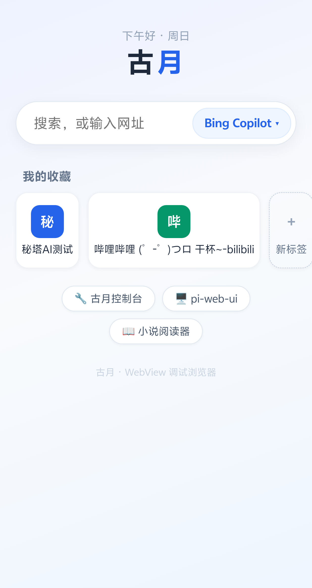
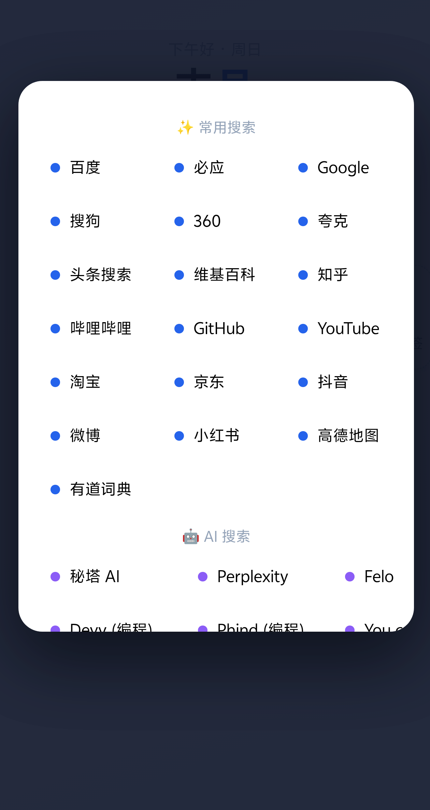
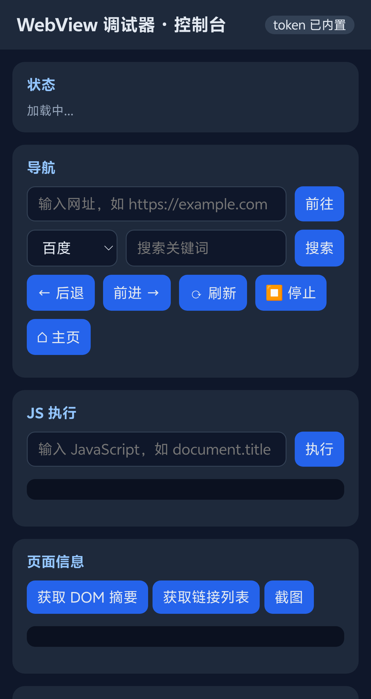

# PhoneWebMCP · 古月

**手机上运行的 WebView 浏览器 + 内置 JSON API + MCP 标准适配层。**
让 AI Agent 直接控制手机里的真实浏览器：打开网页、搜索、滚动、点击、填表、注入 JS、截图、多标签、收藏——**不需要电脑、不需要 ADB、不需要 root**。

A real WebView browser (named 古月/GuYue) running on your phone, exposing a
local JSON API plus a standard MCP adapter. AI agents can drive the browser
directly on-device: navigate, search, scroll, click, fill forms, evaluate JS,
screenshot, multi-tab, bookmarks — **no PC, no ADB, no root required**.

---

## Why / 为什么做这个

Existing Android automation all requires a PC:
- **Appium / UIAutomator**: needs USB/ADB from a computer
- **Android MCP servers** (android-remote-control-mcp, Android-MCP, ...): ADB over USB/LAN from an external agent
- **CDP remote debugging**: needs `chrome://inspect` on a desktop

PhoneWebMCP flips this: the phone itself hosts the browser **and** the
control API. Anything on the phone (Termux, pi, a local agent) can drive it.
It also works as a normal multi-tab browser when no agent is driving it.

> 已有方案都要电脑（ADB/局域网）。PhoneWebMCP 让手机自含浏览器 + 控制接口，
> 单机闭环，零权限烦恼（普通 App 即可，无需 root/ADB/无障碍）。

## Features / 功能

| | | |
|---|---|---|
|  |  |  |

- **真实浏览器**：多标签（最多 8）、收藏、29 个搜索引擎（含中文 AI 搜索：秘塔/Kimi/豆包）、UA 切换（11 种）、缓存管理、Cookie、JS 控制台
- **自动化 API**：navigate / search / scroll / click(selector·text·coordinate) / fill / evaluate / wait / waitFor / dom / links / screenshot / tabs / bookmarks / settings / cache
- **MCP 标准适配层**：零依赖 Python，任何 MCP 客户端（Claude Code、Cursor、pi…）即插即用
- **内置 Web 控制台**：手机浏览器访问 `http://127.0.0.1:8765/` 可视化操作
- **中文界面**：全中文 UI 与搜索引擎
- **安全**：仅监听 127.0.0.1 + 随机 token 鉴权 + 持久化

## Architecture / 架构

```
┌─────────────────────────────── Phone ───────────────────────────────┐
│  ┌──────────┐   HTTP/JSON    ┌──────────────────────────────┐       │
│  │  古月 App │◄──────────────►│  127.0.0.1:8765 (localhost)   │       │
│  │  WebView │                │  random token auth            │       │
│  └──────────┘                └───────┬──────────────┬────────┘       │
│                                      │              │                │
│  Termux / pi  (curl or gu.py)        │    MCP server (stdio)          │
│  any local agent                     │    → Claude/Cursor/pi         │
└──────────────────────────────────────┴───────────────────────────────┘
```

## Quick Start / 快速开始

### 1. Install the APK / 安装 App

Download the latest APK from [Releases](../../releases), install it on your
Android phone (Android 8+, no root needed), open the app.

### 2. Drive it / 控制它

```bash
# Token is shown in the app's info panel, or extract from the web console:
TOKEN=$(curl -s http://127.0.0.1:8765/ | grep -oP "const T='\K[0-9a-f]{32}")

# Open a page
curl -H "X-Api-Token: $TOKEN" -X POST -d '{"url":"https://www.bilibili.com"}' \
     http://127.0.0.1:8765/api/navigate

# Search with an AI engine
curl -H "X-Api-Token: $TOKEN" -X POST \
     -d '{"query":"人工智能","engine":"秘塔 AI"}' http://127.0.0.1:8765/api/search

# Click by visible text, fill a form, scroll
curl -H "X-Api-Token: $TOKEN" -X POST -d '{"text":"百度一下"}'  http://127.0.0.1:8765/api/click
curl -H "X-Api-Token: $TOKEN" -X POST -d '{"selector":"#index-kw","value":"hello"}' http://127.0.0.1:8765/api/fill
curl -H "X-Api-Token: $TOKEN" -X POST -d '{"dir":"down","px":500}' http://127.0.0.1:8765/api/scroll

# Screenshot (base64 PNG)
curl -H "X-Api-Token: $TOKEN" http://127.0.0.1:8765/api/screenshot
```

Or use the bundled CLI client `skills/gu-browser-automation/scripts/gu.py`:

```bash
python3 gu.py navigate https://www.bilibili.com
python3 gu.py search "人工智能" --engine "秘塔 AI"
python3 gu.py fill --selector "#index-kw" --value "关键词"
python3 gu.py click --text "百度一下"
python3 gu.py screenshot --out page.png
```

### 3. Connect via MCP / MCP 接入

```bash
pip install -r mcp-server/requirements.txt   # empty: zero dependencies
python3 mcp-server/phonewebmcp.py            # stdio MCP server

# Claude Code:
claude mcp add phonewebmcp -- python3 /path/to/phonewebmcp.py
```

Any MCP client can then call 25+ browser tools. See [docs/MCP.md](docs/MCP.md).

### 4. As a pi skill / 作为 pi skill

Copy `skills/gu-browser-automation/` into your pi agent skills directory to
let pi agents drive the phone browser (see its SKILL.md).

## API Overview / API 总览

Full docs: [docs/API.md](docs/API.md)

| Area | Endpoints |
|---|---|
| Navigation | `/api/navigate` `/api/search` `/api/back` `/api/forward` `/api/reload` `/api/status` `/api/history` |
| Interaction | `/api/scroll` `/api/click` `/api/fill` `/api/evaluate` `/api/wait` `/api/waitFor` |
| Content | `/api/dom` `/api/links` `/api/screenshot` |
| Tabs | `/api/tabs` `/api/tab/new` `/api/tab/switch` `/api/tab/close` |
| Bookmarks | `/api/bookmarks` `/api/bookmark/add` `/api/bookmark/remove` |
| Data | `/api/cache/clear` `/api/cookies/clear` `/api/form/clear` `/api/clear-all` `/api/cookies` `/api/cookie/set` |
| Settings | `/api/settings` (userAgent / javaScript / domStorage / cacheMode / safeBrowsing / mixedContent ...) |

Auth: header `X-Api-Token: <token>` or `?token=` query param.

## Search Engines / 搜索引擎 (29)

- **常用**: 百度 必应 Google 搜狗 360 夸克 头条 维基百科 知乎 哔哩哔哩 GitHub YouTube 淘宝 京东 抖音 微博 小红书 高德地图 有道词典
- **AI**: 秘塔 AI Perplexity Felo Devv(编程) Phind(编程) You.com Kagi 豆包 Kimi Bing Copilot

## Build / 构建

```bash
# Android 8+ / API 34, JDK 17
# 1. install Android SDK cmdline-tools + platforms;android-34 + build-tools;34.0.0
# 2. create local.properties:  sdk.dir=/path/to/android-sdk
./gradlew :app:assembleDebug
# output: app/build/outputs/apk/debug/app-debug.apk
```

CI builds APKs automatically on every push / tag: see `.github/workflows/build.yml`.

## Security / 安全

- API 只监听 `127.0.0.1`，不暴露局域网
- 随机 token 鉴权（App 启动时生成并持久化，进程重启不变）
- 其他 App 理论上也可访问 localhost —— 仅在**可信设备**上安装使用
- 详情: [docs/SECURITY.md](docs/SECURITY.md)

## Notes / 注意事项

- 部分国产 ROM（vivo/OriginOS 等）会冻结后台 App：控制前先唤醒
  `am start -n com.phonewebmcp.gu/.MainActivity`（内置客户端自动处理），
  或在系统设置中允许该 App 后台运行
- 端口固定 8765；token 在 App「信息」面板可见

## License / 许可

MIT
